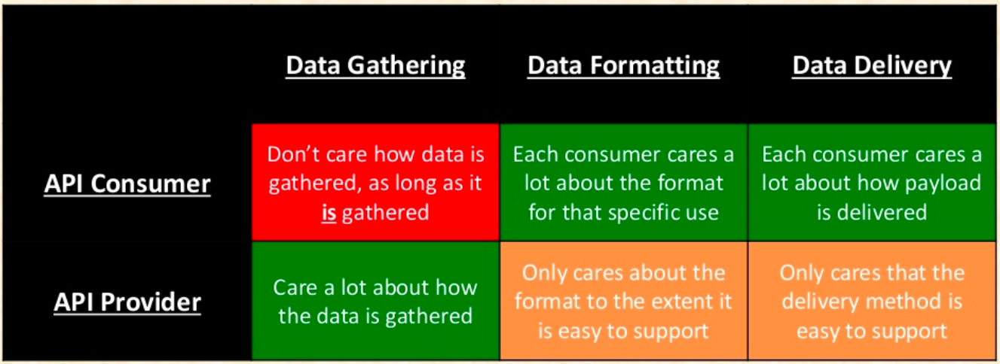

# Introducere API-uri web

Dezvoltarea intrumentelor care mijlocesc accesul la resursele digitale expuse pe WWW a condus la necesitatea de a standardiza, de a uniformiza modul în care componente software vitale asigură interacțiunea, prelucrarea și afișarea datelor. Aceste mecanisme de uniformizare a accesului și lucrului cu diferitele componente ale unei platforme web se numesc generic API-uri Web. API-urile web nu sunt destinate lucrului curent al utilizatorului, ci mai degrabă a programatorului, care le proiectează și a mașinilor de calcul care le exploatează.

API-urile permit diferitelor programe să comunice.

API-urile Web sunt cele care permit programarea web, fie că vorbim de browser sau de server. Pur și simplu transformă întreaga platformă web într-un instrument programabil. API-urile Web sunt legate de programarea web atunci când ne referim la browser. Cea mai cunoscută implementare a API-urilor web la nivel de server sunt API-urile REST.

Economia API-urilor Web este strâns legată de interacțiunea a două părți: producătorii de API-uri și consumatorii acestora.

## Date, date, date

[Top 10 Lessons Learned from the Netflix API - OSCON 2014](https://www.slideshare.net/danieljacobson/top-10-lessons-learned-from-the-netflix-api-oscon-2014)

## Acronime explicate

- API - Application Programming Interface;
- REST - Respresentational State Transfer;

## Resurse

- [Web APIs de la Mozilla Developer Network](https://developer.mozilla.org/en-US/docs/Web/API)
- [Accessing hardware devices on the web | web.dev](https://web.dev/devices-introduction/)
- [API University | programmableweb.com](https://www.programmableweb.com/api-university)
- [API Search](http://apis.io/)
- [Web API | Wikipedia](https://en.wikipedia.org/wiki/Web_API)
- [WEB DESIGN AND APPLICATIONS | W3C](https://www.w3.org/standards/webdesign/)
- [Web API Working Group Charter | W3C](https://www.w3.org/2006/webapi/admin/charter)
