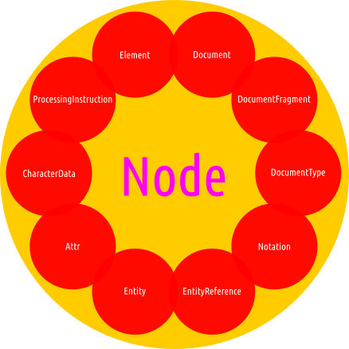
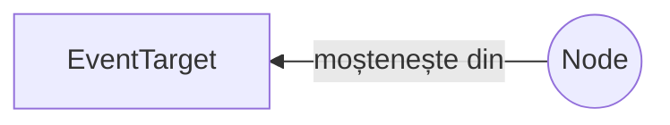

# Proprietățile interfeței Node

Nodurile sunt unitățile care constituie părțile constructive ale DOM-ului. Aceste noduri sunt dispuse într-un arbore numit în engleză *node tree*.

Interfața `Node` este considerată a fi o **interfață fundamentală**. În DOM, `Node`-ul este unitatea de bază pentru a accesa datele. Este un reper fix.

`Node` este o interfață de la care moștenesc o serie de tipuri DOM printre care `Document`, `Element`, `CharacterData` (de la care moștenesc la rândul lor `Text`, `Comment` și `CDATASection`), `ProcessingInstruction`, `DocumentFragment`, `DocumentType`, `Notation`, `Entity`, `EntityReference`.



Standardul spune că această interfață este „tipul de dată primar pentru întreg DOM-ul”. Atenție, nu toate nodurile pot avea copii.

Fiecare `node` are două proprietăți care îl descriu: `nodeType` și `nodeName`.

## Moștenire

Interfața `Node` pe lângă proprietățile sale, mai moștenește și din `EventTarget`.




## Tipuri de noduri

Nodurile pot fi noduri de elemente (de ex. elementul `<p>`), noduri de text, care sunt chiar fragmentele text din nodurile elementelor, noduri care reprezintă atribute, de exemplu `class=".modifica"` sau `id="suntUnic"`.

## Mantre

- Dintre toate proprietățile doar două pot fi și scrise, nu numai să fie citite. Restul pot fi doar citite. Acestea sunt: `Node.nodeValue` și `Node.textContent`.

## Node.baseURI

Este o proprietate read-only.
Returnează un `DOMString` care reprezintă URL-ul de bază a documentului care conține nodul. URL-ul de bază este folosit pentru momentul când browserul are nevoie să obțină un URL absolut. Acesta este cazul imaginilor `` pentru a contrui întregul URL folosind calea din `src` sau în cazul în care ai un `xml:href`.

Acest link poate fi afectat de elementul `base` și/sau `xml:base`. Dacă nu se poate constitui un URL, valoarea va fi `null`. Valoarea din oficiu este adresa documentului (`window.location`). Această valoare se modifică atunci documentul este creat dinamic.

Ref:

- [The baseURI attribute’s getter... | DOM Living Standard](https://dom.spec.whatwg.org/#dom-node-baseuri)
- [baseURI | MDN](https://developer.mozilla.org/en-US/docs/Web/API/Node/baseURI)

## Node.childNodes

Este o proprietate read-only.
Returnează un `NodeList` live cu toți copiii nodului curent. Lista indexată pozițional precum un `Array` care se constituie, este una de obiecte, nu de string-uri. Pentru că este live, lista `NodeList` va fi actualizată pentru fiecare modificare care apare.

```javascript
// Să presupunem că avem un element `<div>` în care sunt mai multe elemente.

// Verifică dacă elementul are noduri copil
if (elemDiv.hasChildNodes()) {
  let copii = elemDiv.childNodes;

  for (let i = 0; i < copii.length; i++) {
    // aplică o operațiune pentru fiecare copii[i]
    // NOTE: Lista este live! Adăugarea sau eliminarea copiilor va modifica lungimea listei
  }
}
```

Vezi metoda `Node.hasChildNodes()` pentru că asigură un tandem de lucru solid.

## Node.firstChild

Este o proprietate read-only.
Returnează un `Node` care reprezintă primul copil al nodului curent sau `null` dacă nu există vreunul.

```javascript
// ștergerea tuturor copiilor dintr-un nod
function removeAllChildren(element) {
  while (element.firstChild) {
    element.removeChild(element.firstChild)
  }
}
```

Spațiile albe folosite pentru a scrie codul HTML cât mai lizibil, în spate creează noduri `#text` și astfel, ar putea conduce la concluzii și efecte neprevăzute. Pentru fragmentul HTML de mai jos, avem posibilul cod.

```html
<p id="paragraf">
  <span>Un fragment de text</span>
</p>
```

Scriptul va indica prezența unui nod de text, care este, de fapt textul folosit pentru a realiza indentarea vizuală a elementului `<span>`.

```javascript
<script>
  var unPara = document.getElementById('paragraf');
  console.log(unPara.firstChild.nodeName); // va afișa '#text'
</script>
```

Acest exemplu este luat de la MDN și merită adăugată mențiunea că orice formă de spațiu alb, este considerată a fi un nod text. Comentariile în HTML vor întoarce un rezultat `#comment`. Există o soluție pentru a evita astfel de comportament și constă în utilizarea lui `ParentNode.firstElementChild`. Totuși, această soluție necesită un polyfill pentru IE9 și Safari.

## Node.isConnected

Este o proprietate read-only.
Este o valoare `Boolean` care indică dacă nodul este conectat (direct sau indirect) la obiectul context, adică la obiectul `Document` în cazul DOM-ului sau la `ShadowRoot` în cazul unui shadow DOM.

## Node.lastChild

Este o proprietate read-only.
Returnează ultimul copil al nodului curent sau `null`, dacă nu există vreunul.

## Node.nextSibling

Este o proprietate read-only.
Returnează un `Node` care reprezintă următorul nod din arbore sau `null` dacă nu există vreunul.

## Node.nodeName

Este o proprietate read-only.
Returnează un `DOMString` care conține numele nodului. Numele va avea o structură care variază în funcție de tipul nodului. De exemplu, un nod `Text` va avea un string `#text`, iar un nod `Document` va avea un string `#document`.

## Node.nodeType

Returnează un `short` care reprezintă tipul nodului.

| Nume                        | Valoare |
|:--------------------------- |:------- |
| ELEMENT_NODE                | 1       |
| ATTRIBUTE_NODE              | 2       |
| TEXT_NODE                   | 3       |
| CDATA_SECTION_NODE          | 4       |
| ENTITY_REFERENCE_NODE       | 5       |
| ENTITY_NODE                 | 6       |
| PROCESSING_INSTRUCTION_NODE | 7       |
| COMMENT_NODE                | 8       |
| DOCUMENT_NODE               | 9       |
| DOCUMENT_TYPE_NODE          | 10      |
| DOCUMENT_FRAGMENT_NODE      | 11      |
| NOTATION_NODE               | 12      |

Este o proprietate utilă pentru a determina dacă nodul este de un anumit tip sau nu. Proprietatea va indica o valoare numerică ce corespunde tipului de nod.

```javascript
// <a href="#">un link</a>
console.log(
  document.querySelector('a').nodeName, // A
  document.querySelector('a').nodeType  // 1
);
console.log(document.querySelector('a').nodeType === Node.ELEMENT_NODE); // true
```

## Node.nodeValue

Returnează sau setează valoarea nodului curent. Această valoare este un șir de caractere care se află în nod, dacă acestea există. Pentru `document` în sine, `nodeValue` returnează `null`. Pentru text, comment și noduri CDATA, `nodeValues` returnează conținutul nodului. Pentru nodurile atribut va fi returnată valoarea acestuia.

Reține faptul că această proprietate returnează textul care este conținut de nod și atunci când se atribuie o valoare nouă, va modifica conținutul nodului.

```javascript
// <a href="#">un link</a>
console.log(document.querySelector('a').firstChild.nodeValue); // un link
```

## Node.ownerDocument

Este o proprietate read-only.
Returnează `Document`-ul de care ține nodul. Dacă nodul în sine este un alt document, este returnat `null`.

## Node.parentNode

Este o proprietate read-only.
Returnează un `Node` care este părintele nodului curent. Dacă nu există un astfel de nod, cel curent făcând parte din cei din top, sau nu face parte dintr-un arbore, proprietatea returnează valoarea `null`. Este o proprietate cu ajutorul căreia poți lucra cu părintele unui element în scopul aducerii de modificări în structura acestuia. Scenariul cel mai des întâlnit este cel al adăugării sau eliminării de elemente.

```javascript
var elementReferință = document.querySelect("#cineva");
elementReferință.parentNode.removeChild(elementReferință.parentNode.firstChild);
// va șterge primul element copil din părintele lui elementReferință
```

Cu ajutorul acestei proprietăți poți verifica dacă elementul părinte al celui curent are o anumită clasă sau dacă are date introduse prin atributul `data-*`.

```javascript
if (element.parentNode.classList.contains('suntgalben')) {
  console.log('Sunt un element galben');
}
```

Proprietatea `parentNode` este *chainable*, adică permite mișcarea pe DOM în sus și în jos.

```javascript
console.log(elementReferință.parentNode.parentNode.nodeName);
```

Poți insera cu precizie un alt element lângă unul țintit.

```javascript
var elementNou = document.createElement('p');
var elementReferință = document.querySelect('#suntreferinta');
elementReferință.parentNode.insertBefore(elementNou, elementReferință.nextSibling);
```

## Node.parentElement

Este o proprietate read-only.
Returnează un `Element` care este părintele acestui nod. Dacă nodul nu are părinte sau dacă acel părinte nu este `Element`, această proprietate va returna `null`.

## Node.previousSibling

Este o proprietate read-only.
Returnează un `Node` care reprezintă nodul anterior din arbore sau `null` dacă nu există un astfel de nod.

## Node.textContent

Returnează sau setează conținutul textual al unui element și a tuturor descendenților acestuia.


## Referințe

- [Node | MDN](https://developer.mozilla.org/en-US/docs/Web/API/Node)
