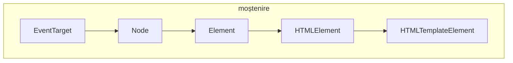

# Elementul template

Acest element oferă o modalitate de a include taguri HTML care nu vor fi afișate imediat la momentul în care pagina s-a încărcat. Aceste fragmente de HTML vor putea fi inserate în DOM la un moment dat ca răspuns al unui eveniment.

Conținutul elementelor `<template>` vor fi parcurse de motorul browerului, dar nu vor fi afișate.

`HTMLTemplateElement` are o proprietate `content` care este read-only, fiind un `DocumentFragment` ce conține fragmentul de arbore care trebuie inserat în DOM pe care template-ul îl reprezintă.

## Părinți admiși

- `body`,
- `frameset`
- `head`
- `dl`
- `colgroup`

## DOM

Interfața DOM răspunzătoare pentru accesul la conținutul acestui element este `HTMLTemplate​Element`. Aceasta are o proprietate `content`. Această proprietate este un `DocumentFragment` (obiect care este un fragment de document DOM) care conține un arbore DOM read-only, fiind reprezentarea template-ului.



Fragmentele pot fi clonate și inserate în document folosindu-se JavaScript.

```html
<template id="fisa-biblio">
  <ul id="unitate">
    <li class="titlu"></li>
    <li class="autor"></li>
    <li class="editura"></li>
  </ul>
</template>

<section id="ubeuri"></section>
```

Template-ul va fi gestionat de JavaScript.

```javascript
// datele
let date = [
  {titlu: 'Amurgul cailor', autor: 'Emil Vinicius', editura: 'Ace'},
  {titlu: 'Când pleacă vacile', autor: 'Paris Maglavit', editura: 'Saniti'},
  {titlu: 'Vin crocodili', autor: 'Magdalena Ifrim', editura: 'Panika'}
];

// selectăm template-ul
let template = document.querySelector('#fisa-biblio').content;
// selectăm inserția
let ins = document.querySelector(`#ubeuri`);

// populare template
for (let ub of date) {
  // clonezi întreaga structură
  let fișa = template.cloneNode(true);

  fișa.querySelector(`.titlu`).textContent = ub.titlu;
  fișa.querySelector(`.autor`).textContent = ub.autor;
  fișa.querySelector(`.editura`).textContent = ub.editura;

  ins.appendChild(fișa);
}

// sau faci un `importNode`
const template = document.querySelector('template');
const node = document.importNode(template.content, true);
ins.appendChild(node);
```

Există o diferență între `cloneNode()` și `importNode()`. Chiar dacă rezultatul pare același, `cloneNode()` este folosit atunci când clonezi un nod (adică ce este definit în `<template>`) din documentul curent. Când dorești să clonezi un nod dintr-un alt document, vei folosi `importNode()`. De exemplu, dintr-un `iframe`. Mai jos este un exemplu.

```javascript
let frame = document.getElementsByTagName("iframe")[0],
    paragrafe = frame.contentWindow.document.getElementsByTagName("p")[0];
document.importNode(paragrafe);
```

O metodă smilară lui `importNode` este `adoptNode()`, care va elimina nodul din documentul de origine.

## Atașarea de evenimente pe template-uri

Evenimentele pentru care atașezi receptori (funcții cu rol de callback) pe întregul template clonat, nu va funcționa pentru că vei lucra cu o instanță `DocumentFragment`. Pentru a avea posibilitatea de a crea elemente pe care să poți atașa evenimente, fă referință la elemente din interiorul template-ului: `template.content.firstElementChild.cloneNode(true)`.

Un alt scenariu care permite ar fi să faci o referință la conținutul clonat al template-ului și odată având la îndemână această instanță, să țintești elemente din interior folosind selectoarele cunoscute precum `querySelector` sau `querySelectorAll`.

```javascript
var clonaTemplate = template.content.cloneNode(true);
var taguri = clonaTemplate.querySelector(`.taguri`);
for (var idx = 0; idx < taguri.length; idx += 1) {
  taguri[idx].addEventListener('click', nume_functie_callback);
}
```

## Resurse

- [W3 HTML5 - A vocabulary and associated APIs for HTML and XHTML](https://www.w3.org/TR/html5/)
- [HTML. Living Standard. 9 aprilie, 2018](https://html.spec.whatwg.org/multipage/scripting.html#the-template-element)
- [Using templates and slots | MDN](https://developer.mozilla.org/en-US/docs/Web/Web_Components/Using_templates_and_slots)
- [Document.importNode VS Node.cloneNode (real example) | stackoverflow | 2022](https://stackoverflow.com/questions/39372886/document-importnode-vs-node-clonenode-real-example)
